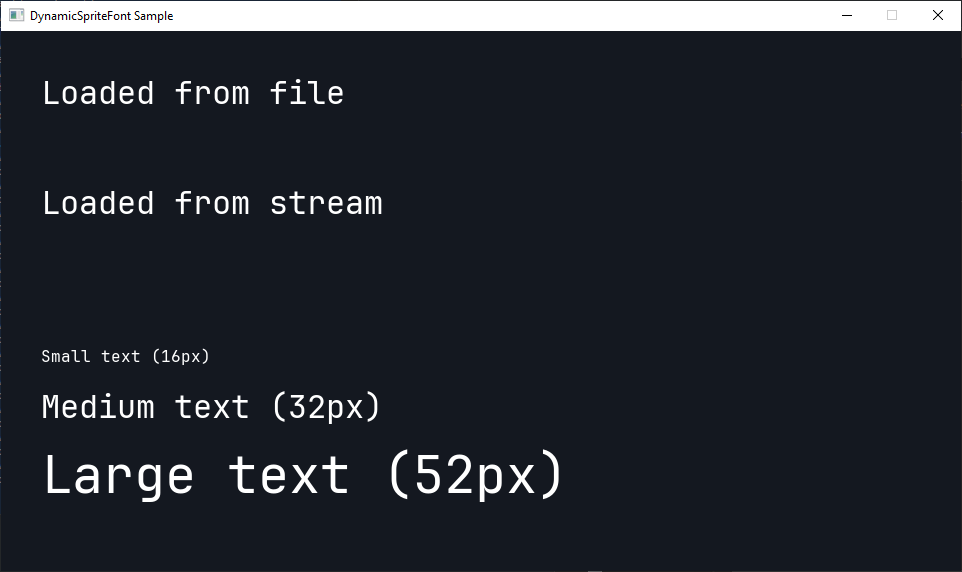

# DynamicSpriteFont Sample



This repo contains a small sample that demonstrates `DynamicSpriteFont` with:

- `DynamicSpriteFont.FromFile(...)`
- `DynamicSpriteFont.FromStream(...)`
- `SpriteBatch.DrawString(...)`
- drawing small, medium, and large text with the same runtime font

The runnable sample projects are [DynamicSpriteFontSample.WindowsDX12.csproj](/c:/dev/spritefont-agent/sample/DynamicSpriteFontSample.WindowsDX12/DynamicSpriteFontSample.WindowsDX12.csproj) and [DynamicSpriteFontSample.Vulkan.csproj](/c:/dev/spritefont-agent/sample/DynamicSpriteFontSample.Vulkan/DynamicSpriteFontSample.Vulkan.csproj). The shared sample code lives in [DynamicSpriteFontSample.Core.csproj](/c:/dev/spritefont-agent/sample/DynamicSpriteFontSample.Core/DynamicSpriteFontSample.Core.csproj).

## Prerequisites

Before running the sample, make sure you have:

- Premake 5 on your `PATH`
- CMake on your `PATH`
- MSBuild on your `PATH`
- Visual Studio 2022 or newer if you want to use Visual Studio
- Vulkan SDK if you want to run the Vulkan sample

The sample depends on the local MonoGame submodule and on native binaries that are built from source.

## Clone And Prepare

If you are cloning the repo for the first time:

```powershell
git clone https://github.com/AristurtleDev/MonoGameDynamicSpriteFontSample.git
cd MonoGameDynamicSpriteFontSample
git submodule update --init --recursive
```

## Build The Native Runtime

The sample projects copy the native `mgruntime` binaries out of the local MonoGame build output, so you need to build that first.

From the repo root:

```powershell
cd external/MonoGame
dotnet run --project build\Build.csproj
cd ..\..
```

That step produces the native files the sample expects under `external/MonoGame/Artifacts/native/mgruntime/...`.

## Run With The .NET CLI

Windows DX12:

```powershell
dotnet run --project .\sample\DynamicSpriteFontSample.WindowsDX12\DynamicSpriteFontSample.WindowsDX12.csproj
```

Vulkan:

```powershell
dotnet run --project .\sample\DynamicSpriteFontSample.Vulkan\DynamicSpriteFontSample.Vulkan.csproj
```

## Run With Visual Studio

1. Open [DynamicSpriteFontSample.slnx](DynamicSpriteFontSample.slnx) in Visual Studio.
2. In Solution Explorer, right-click the startup project you want:
   `DynamicSpriteFontSample.WindowsDX12` or `DynamicSpriteFontSample.Vulkan`.
3. Choose `Set as Startup Project`.
4. Press `F5` or click `Start`.

## Troubleshooting

- If the sample starts but cannot find the native runtime, make sure the `Build Native` step completed successfully.
- If the Vulkan sample does not start, confirm that the Vulkan SDK is installed.
- If the submodule folder is missing or empty, run `git submodule update --init --recursive` again.
